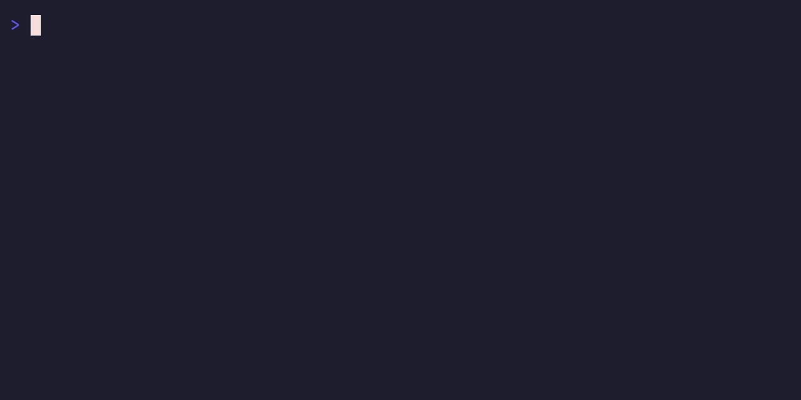

# agent-tty

Give your AI agent a real terminal it can drive, and get back reviewable snapshots, screenshots, and recordings of everything it did.

> It's like Playwright, but for terminal apps instead of web pages.

[](https://www.npmjs.com/package/agent-tty)
[](https://github.com/coder/agent-tty/actions/workflows/ci.yml)
[](./LICENSE)




Tools like `tmux` or `screen` help _you_ manage your own terminal windows. `agent-tty` is for handing a real, long-lived terminal to an AI coding agent, so it can run commands, drive interactive apps like `nvim` or `htop`, and read the screen back. Because every session is recorded, you never have to take the agent's word for what happened: you (or another agent) get a plain-text snapshot, a real screenshot, or a video of the actual screen, and can replay it to check the work. It works just as well for plain shell automation and CI smoke tests with no agent involved.

## What you'd use it for

- **Proof you can review.** An agent runs a task and attaches the screenshot, video, or replayable recording to its PR, so a human can confirm at a glance that the change really worked, instead of trusting a log.
- **A tighter feedback loop.** Tell the agent to actually _use_ the TUI it just built or fixed, then read the screen back, so it catches a broken layout itself before you ever see it.
- **Reproducing terminal bugs.** Spin up a clean, isolated terminal, reproduce a flaky TUI bug report there, hand it to an agent to attempt a fix, and verify the fix with a fresh recording.

## Quickstart

Requires Node `>=24 <27`. Screenshots and WebM video also need a Playwright Chromium install (`npx playwright install chromium`).

```bash
npm install -g agent-tty

# Sessions, logs, and artifacts live under ~/.agent-tty by default.
# Optionally point AGENT_TTY_HOME at a throwaway dir for an isolated run:
export AGENT_TTY_HOME="$(mktemp -d)"
agent-tty doctor --json                  # check your environment

# Open a session, do something, wait for it, look at the result.
SID=$(agent-tty create --json -- /bin/bash | jq -r '.result.sessionId')
agent-tty run "$SID" 'printf "hello from agent-tty\n"' --json
agent-tty wait "$SID" --text 'hello from agent-tty' --json
agent-tty snapshot "$SID" --format text --json
agent-tty screenshot "$SID" --json
agent-tty destroy "$SID" --json
```

Driving an interactive TUI is the same loop, with key chords and a wait for the screen to settle:

```bash
agent-tty run "$SID" 'nvim --clean' --no-wait --json
agent-tty wait "$SID" --screen-stable-ms 1000 --json
agent-tty send-keys "$SID" Down Down Enter --json
agent-tty screenshot "$SID" --json
agent-tty record export "$SID" --format webm --json
```

More workflows are in [`docs/USAGE.md`](./docs/USAGE.md). Other install paths (tarballs, prerelease channels, source checkouts) are in [`docs/INSTALL.md`](./docs/INSTALL.md).

## Why not just tmux, expect, asciinema, or Playwright?

Those tools are good, and you can get partway with any of them. `agent-tty` exists because driving a terminal _and_ getting reviewable evidence back is awkward with each one:

| If you reach for…                     | You get                                         | What `agent-tty` adds                                                                                                                                |
| ------------------------------------- | ----------------------------------------------- | ---------------------------------------------------------------------------------------------------------------------------------------------------- |
| `tmux` + `send-keys` / `capture-pane` | drive a pane, scrape raw bytes                  | a `wait`-for-condition primitive (stop sleeping and grepping), semantic snapshots, and PNG / `.cast` / WebM artifacts a process or human can review  |
| `expect`                              | scripted input/output matching on a byte stream | a model of the _rendered screen_ (cursor, alt-screen, colors), plus shareable visual artifacts                                                       |
| `asciinema` / VHS                     | a recording to watch later                      | programmatic drive + `wait` + inspect, so you act on terminal state instead of only recording it (and it still exports asciinema-compatible `.cast`) |
| Playwright                            | this exact stateful loop, for browsers          | the same drive → wait → inspect → snapshot loop, applied to terminals and TUIs                                                                       |

One practical difference worth calling out: `agent-tty` produces real **PNG screenshots and WebM video** of the rendered screen, not just text or an asciicast. That means the proof an agent attaches to a PR is something a human can glance at inline, with no special player.

`agent-tty` is an automation-and-inspection layer, not a tmux replacement.

## Watch sessions live

`agent-tty dashboard` opens a read-only, interactive view that lists your sessions and live-mirrors the selected one, so you can watch what your agents are doing in their shells (for example in a `tmux` split). It reads the append-only event log as its source of truth and never interrupts the running session. It needs the `libghostty-vt` renderer and an interactive terminal; machine-readable listing stays available via `list --json`.

## How it works

```text
agent-tty CLI → per-session host → PTY + append-only event log → Ghostty renderer → artifacts
```

Every session is backed by a real PTY (`node-pty`) and an append-only event log. The log is the source of truth, so snapshots, screenshots, and recordings can be regenerated deterministically by replaying it, even after the session has exited.

Rendering uses Ghostty's terminal engine through two interchangeable backends (`--renderer`):

- **`libghostty-vt`** — Ghostty's native VT engine, bound into Node. Fast, browser-free semantic snapshots and `wait` checks. Also powers the dashboard.
- **`ghostty-web`** (default) — a headless web build of Ghostty driven by Playwright/Chromium. Adds pixel PNG screenshots and WebM video.

`ghostty-web` is a _reference_ renderer: it shows what a pinned Ghostty build draws, not a pixel-for-pixel guarantee of any particular native terminal window. That tradeoff is deliberate. The renderer sits behind an adapter, so native backends can be added later without changing the CLI contract.

## Where it came from

I maintain [`coder/claudecode.nvim`](https://github.com/coder/claudecode.nvim) and was drowning in issues and PRs I couldn't easily reproduce. Neovim is a TUI, and "reproduce this, configure that, screenshot the result" is painful to script with sleeps and `capture-pane`. `agent-tty` lets me spin up an isolated, reproducible terminal, hand it to a coding agent to attempt a fix, and then verify the fix with a fresh session and a recording I can actually look at.

A colleague then used `agent-tty` to build an experimental TUI for Coder agents almost entirely by letting coding agents drive it, checking the screenshots and recordings it produced instead of watching over their shoulder. That's the loop it's built for: an agent acts, `agent-tty` captures reviewable evidence, and a human (or another agent) verifies.

## Demos

Real Codex and Claude TUIs discovering the `agent-tty` skill, driving `nvim --clean`, writing a file, and exporting inner proof artifacts. (GitHub renders these as click-to-play players.)

<table>
  <tr>
    <th width="50%">Codex</th>
    <th width="50%">Claude</th>
  </tr>
  <tr>
    <td><video src="https://github.com/user-attachments/assets/f1823164-330c-4962-8adf-2b825080e06f" controls width="100%"></video></td>
    <td><video src="https://github.com/user-attachments/assets/966bed35-9383-444e-b06a-1d103ccba49a" controls width="100%"></video></td>
  </tr>
</table>

Full reproducer, transcripts, and proof bundles are in [`dogfood/agent-uses-agent-tty/`](./dogfood/agent-uses-agent-tty/) and [`dogfood/CATALOG.md`](./dogfood/CATALOG.md).

## Command surface

Every user-facing command takes `--json` and returns a stable, machine-readable envelope. The commands cover the session lifecycle (`create`, `list`, `inspect`, `destroy`, `gc`), input and control (`run`, `type`, `paste`, `send-keys`, `batch`, `resize`, `signal`, `mark`), observation and capture (`wait`, `snapshot`, `screenshot`, `record export`), the live `dashboard`, and environment checks (`version`, `doctor`, `skills`).

See [`docs/USAGE.md`](./docs/USAGE.md) for the full flag reference and [`docs/TROUBLESHOOTING.md`](./docs/TROUBLESHOOTING.md) for renderer and environment issues.

## Agent skills

`agent-tty` ships a bootstrap skill so coding agents can load current usage instructions at runtime:

```bash
agent-tty skills list
agent-tty skills get agent-tty
```

See [`docs/AGENT-SKILLS.md`](./docs/AGENT-SKILLS.md).

## Status & platform support

`agent-tty` is `0.3.0` and focused on reliable, isolated, reviewable terminal and TUI automation through a stable CLI.

- Linux and macOS are tier-1; Windows is tier-2 and not CI-tested.
- Screenshots and WebM video depend on Playwright/Chromium and the `ghostty-web` backend.
- `run` is best for shell setup and command injection; it does not capture a child command's structured output or exit status.
- Apache-2.0, runs entirely locally, no account or SaaS.

The supported contract is in [`RELEASE.md`](./RELEASE.md); the architecture is in [`design/ARCHITECTURE.md`](./design/ARCHITECTURE.md).

## Contributing

Issues and PRs welcome. See [`docs/CONTRIBUTING.md`](./docs/CONTRIBUTING.md) and the [`good first issue`](https://github.com/coder/agent-tty/labels/good%20first%20issue) / [`help wanted`](https://github.com/coder/agent-tty/labels/help%20wanted) labels.

```bash
mise install && mise run bootstrap   # preferred
npm run cli -- --help
npm run verify
```

## License

[Apache License 2.0](./LICENSE).
