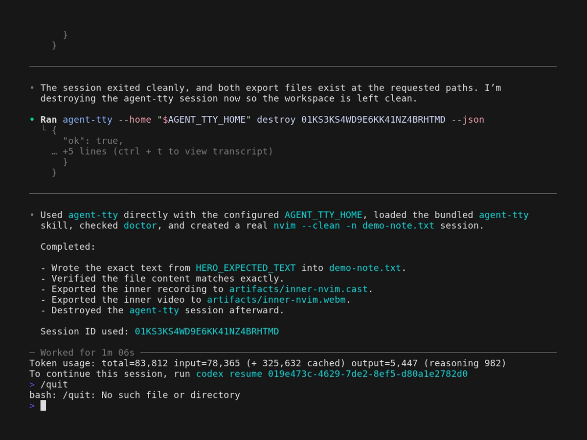
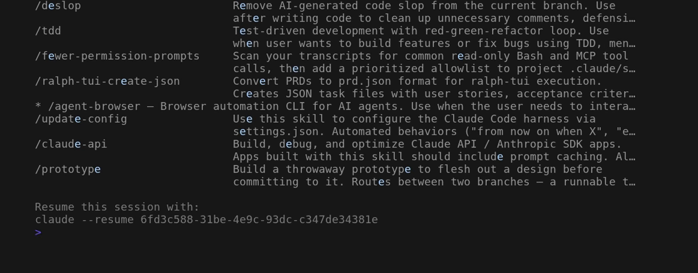

# agent-tty

`agent-tty` is a CLI-first terminal automation tool for AI agents and humans.
It creates long-lived PTY-backed sessions, lets automation drive and inspect those sessions across CLI invocations, and produces reviewable artifacts such as semantic snapshots, PNG screenshots, asciicast recordings, and WebM exports.

The goal is to make terminal and TUI automation inspectable rather than only scriptable.
It is inspired by the `agent-browser` style of agent workflow: give an agent a stateful environment, explicit wait/inspect primitives, and evidence a human can review after the fact.

## Why It Exists

Most terminal automation falls back to brittle patterns: blind sleeps, long simulated keystroke streams, ad hoc screenshots, or detached `tmux` sessions that are hard for another process to inspect.
`agent-tty` provides a tighter loop:

1. create an isolated terminal session,
2. run setup or send input,
3. wait for observable terminal state,
4. inspect the screen semantically,
5. capture renderer-backed visual evidence,
6. export replay artifacts,
7. clean up the session.

That loop is useful for AI coding agents, shell scripts, CI smoke tests, TUI dogfooding, and humans debugging terminal workflows locally.

## What It Provides

- Long-lived terminal sessions backed by `node-pty`.
- A stable, machine-readable CLI surface with JSON envelopes.
- `run`, `type`, `paste`, `send-keys`, `resize`, and `signal` controls.
- `wait` and `snapshot` primitives for semantic inspection.
- Renderer-backed screenshots and WebM exports using `ghostty-web` under Playwright/Chromium.
- Append-only event logs so snapshots, screenshots, and recordings can be replayed from session history.
- Isolated homes via `--home`, useful for agents, tests, CI, and proof bundles.

## How It Works

The architecture is:

```text
agent-tty CLI -> per-session host -> PTY + event log -> ghostty-web renderer -> artifacts
```

The PTY and append-only event log are the execution truth.
`ghostty-web` is the reference renderer for semantic snapshots, screenshots, and replay video; it is not a native-terminal parity guarantee.
The design keeps rendering behind an adapter so future native renderers can be added without changing the public CLI contract.

## Quick Start

`agent-tty` requires Node `>=24 <27`.
Renderer-backed screenshots and WebM export also require a discoverable Playwright Chromium install.

```bash
npm install -g agent-tty

AGENT_HOME="$(mktemp -d)"
agent-tty --home "$AGENT_HOME" doctor --json

SESSION_ID=$(agent-tty --home "$AGENT_HOME" create --json --name demo -- /bin/bash | jq -r '.result.sessionId')
agent-tty --home "$AGENT_HOME" run "$SESSION_ID" 'printf "hello from agent-tty\n"' --json
agent-tty --home "$AGENT_HOME" wait "$SESSION_ID" --text 'hello from agent-tty' --json
agent-tty --home "$AGENT_HOME" snapshot "$SESSION_ID" --format text --json
agent-tty --home "$AGENT_HOME" screenshot "$SESSION_ID" --json
agent-tty --home "$AGENT_HOME" destroy "$SESSION_ID" --json
```

If Chromium is missing on a fresh machine, run:

```bash
npx playwright install chromium
```

For prerelease channels, tarball installs, authenticated GitHub Release installs, and source-checkout tarballs, see [`docs/INSTALL.md`](./docs/INSTALL.md).

## Agent Demo

This dogfood bundle uses VHS as the outer camera for real Codex and Claude interactive TUIs while each agent explores the `agent-tty` skill/CLI, drives `nvim --clean`, writes a file, and exports inner proof artifacts.

| Codex                                                                                                                                              | Claude                                                                                                                                                |
| -------------------------------------------------------------------------------------------------------------------------------------------------- | ----------------------------------------------------------------------------------------------------------------------------------------------------- |
| [](./dogfood/agent-uses-agent-tty/artifacts/codex-outer.webm) | [](./dogfood/agent-uses-agent-tty/artifacts/claude-outer.webm) |

See [`dogfood/agent-uses-agent-tty/`](./dogfood/agent-uses-agent-tty/) for the Hero Demo reproducer, outer transcripts, inner Neovim recordings, and final file proofs.

## Common Usage

### Run setup inside a shell

```bash
AGENT_HOME="$(mktemp -d)"
SESSION_ID=$(agent-tty --home "$AGENT_HOME" create --json -- /bin/bash | jq -r '.result.sessionId')

agent-tty --home "$AGENT_HOME" run "$SESSION_ID" 'pwd && npm test' --json
agent-tty --home "$AGENT_HOME" snapshot "$SESSION_ID" --format text --json
agent-tty --home "$AGENT_HOME" destroy "$SESSION_ID" --json
```

### Drive an interactive CLI or TUI

```bash
AGENT_HOME="$(mktemp -d)"
SESSION_ID=$(agent-tty --home "$AGENT_HOME" create --json -- /bin/bash | jq -r '.result.sessionId')

agent-tty --home "$AGENT_HOME" run "$SESSION_ID" '<launch-command>' --no-wait --json
agent-tty --home "$AGENT_HOME" wait "$SESSION_ID" --screen-stable-ms 1000 --json
agent-tty --home "$AGENT_HOME" send-keys "$SESSION_ID" Down Down Enter --json
agent-tty --home "$AGENT_HOME" screenshot "$SESSION_ID" --json
agent-tty --home "$AGENT_HOME" destroy "$SESSION_ID" --json
```

### Export reviewer-facing proof

```bash
AGENT_HOME="$(mktemp -d)"
SESSION_ID=$(agent-tty --home "$AGENT_HOME" create --json -- /bin/bash | jq -r '.result.sessionId')

agent-tty --home "$AGENT_HOME" run "$SESSION_ID" 'printf "artifact proof\n"' --json
agent-tty --home "$AGENT_HOME" wait "$SESSION_ID" --text 'artifact proof' --json
agent-tty --home "$AGENT_HOME" screenshot "$SESSION_ID" --json
agent-tty --home "$AGENT_HOME" record export "$SESSION_ID" --format asciicast --json
agent-tty --home "$AGENT_HOME" record export "$SESSION_ID" --format webm --json
agent-tty --home "$AGENT_HOME" destroy "$SESSION_ID" --json
```

For command details, examples, and workflow notes, see [`docs/USAGE.md`](./docs/USAGE.md).

## Command Surface

Global flags:

- `--home <path>`: override the agent-tty home directory.
- `--timeout-ms <n>`: apply a shared CLI timeout budget in milliseconds.
- `--no-color`: disable ANSI color in human-readable output.
- `--log-level <level>`: set log level (`debug`, `info`, `warn`, `error`).
- `--profile <name>`: select a default render profile.
- `--json`: available on user-facing commands for structured output.

Command groups:

- Environment and skills: `version`, `doctor`, `skills list|get|path`.
- Lifecycle: `create`, `list`, `inspect`, `destroy`, `gc`.
- Input and control: `run`, `type`, `paste`, `send-keys`, `resize`, `signal`, `mark`.
- Observation and artifacts: `wait`, `snapshot`, `screenshot`, `record export`.

## Notes And Limitations

- Linux and macOS are tier-1 targets; Windows is tier-2 and not CI-tested.
- Screenshots and WebM export depend on Playwright/Chromium and the bundled `ghostty-web` renderer.
- `ghostty-web` provides reference visual truth, not exact parity with every native terminal emulator.
- `run` is best for shell-oriented setup and bootstrap work. It does not capture command output as a structured result or report the child command's exit status.
- Use `--home <path>` for isolated automation. Passing the same home to every command keeps manifests, sockets, event logs, and artifacts together.
- Run `agent-tty --home <path> doctor --json` before screenshot or recording workflows in a new machine, CI job, or container.

Troubleshooting notes live in [`docs/TROUBLESHOOTING.md`](./docs/TROUBLESHOOTING.md).

## Agent Skills

`agent-tty` ships a thin public bootstrap skill under `skills/agent-tty/` and canonical runtime skills under `skill-data/`.
After installing the CLI, coding agents can load the current runtime instructions directly:

```bash
agent-tty skills get agent-tty
agent-tty skills list
agent-tty skills get dogfood-tui
```

For TanStack Intent, Mux, and direct skill-copy instructions, see [`docs/AGENT-SKILLS.md`](./docs/AGENT-SKILLS.md).

## Vision And Roadmap

The current `0.2.x` line is centered on reliable, isolated, reviewable TUI automation through the CLI.
Future work includes native renderer adapters, broader platform parity, mouse input, richer semantic TUI automation, remote/networked control, and external control layers such as an MCP wrapper.

- [`RELEASE.md`](./RELEASE.md) defines the supported release contract.
- [`ROADMAP.md`](./ROADMAP.md) tracks intentionally deferred work and post-release direction.
- [`design/ARCHITECTURE.md`](./design/ARCHITECTURE.md) explains the architecture and product intent in more detail.

## Local Development

Preferred setup uses `mise`:

```bash
mise install
mise run bootstrap
```

Fallback setup after installing `aube` directly:

```bash
aube exec playwright install chromium
```

Useful local commands:

```bash
npm run cli -- --help
npm run verify
```

Use `npx tsx src/cli/main.ts ...` while developing from a source checkout, and use an isolated absolute `AGENT_TTY_HOME` for tests or manual dogfooding.
For contributor details, see [`docs/CONTRIBUTING.md`](./docs/CONTRIBUTING.md).

## Documentation

- [`docs/README.md`](./docs/README.md) — user, contributor, and maintainer docs map.
- [`docs/INSTALL.md`](./docs/INSTALL.md) — installation paths and release tarball flows.
- [`docs/USAGE.md`](./docs/USAGE.md) — CLI workflows and command examples.
- [`docs/AGENT-SKILLS.md`](./docs/AGENT-SKILLS.md) — packaged agent skill guidance.
- [`docs/TROUBLESHOOTING.md`](./docs/TROUBLESHOOTING.md) — environment and renderer troubleshooting.
- [`design/README.md`](./design/README.md) — architecture and design references.
- [`dogfood/CATALOG.md`](./dogfood/CATALOG.md) — curated proof bundles and review paths.

## License

`agent-tty` is licensed under the [Apache License 2.0](./LICENSE).
