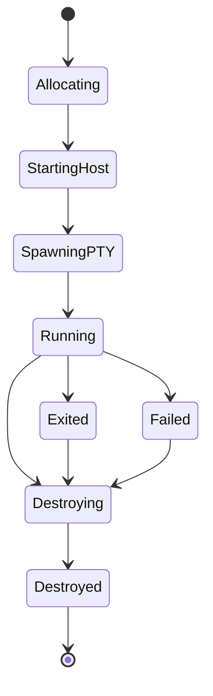

# agent-terminal v1 architecture

## 1. Design principles

### 1.1 General-purpose first

`agent-terminal` must be useful outside Mux.

Concretely, that means:

- no product-specific nouns in the public interface,
- no dependency on agent tool runtimes,
- no assumption that the caller is interactive,
- and no requirement that a host application embed the implementation.

### 1.2 Separate execution from rendering

The PTY process and the visual renderer are related but not identical.

The system must treat them as separate layers because:

- execution truth lives in the PTY event stream,
- screenshots come from a renderer,
- semantic screen state may be rebuilt from the event stream,
- and native-renderer support should be addable later without redesigning session ownership.

### 1.3 Persist enough to replay

Every meaningful session transition must be reconstructable from persisted artifacts.

At minimum, that means persisting:

- session metadata,
- process lifecycle events,
- PTY output chunks,
- input actions,
- resize events,
- and artifact manifests.

### 1.4 Defensive by default

The implementation should prefer quick, explicit failures over silent drift.

Examples:

- assert that session IDs resolve to exactly one session directory,
- assert that renderer replay sequence numbers are monotonic,
- assert that screenshots include the render-profile hash used to generate them,
- assert that a session host refuses commands after terminal teardown unless explicitly supported,
- assert that the on-disk manifest version matches the binary's supported format.

### 1.5 Determinism where possible

V1 should maximize determinism in:

- screenshots,
- replay videos,
- snapshot schemas,
- artifact paths,
- and fixture-based tests.

Native rendering is intentionally deferred because it weakens determinism.

## 2. Process model

V1 uses a **per-session host process**.

### 2.1 Why not a global daemon?

A global daemon is attractive but not necessary for v1.

A per-session host gives simpler isolation:

- one broken session does not poison all sessions,
- replay state is local to the session,
- lifecycle logic is easier to test,
- and a future global coordinator can be added later without breaking the CLI.

### 2.2 Public vs internal processes

Public binary:

- `agent-terminal`

Internal host entrypoint:

- `agent-terminal _host --session-id ...`

The internal `_host` subcommand is not documented for end users and may change without semver guarantees.

## 3. Suggested repository layout for a standalone implementation

```text
agent-terminal/
├── src/
│   ├── cli/
│   │   ├── main.ts
│   │   ├── commands/
│   │   └── output/
│   ├── host/
│   │   ├── hostMain.ts
│   │   ├── controlServer.ts
│   │   ├── sessionState.ts
│   │   ├── eventLog.ts
│   │   ├── artifactManager.ts
│   │   └── replayCache.ts
│   ├── protocol/
│   │   ├── rpc.ts
│   │   ├── envelopes.ts
│   │   ├── schemas.ts
│   │   └── errors.ts
│   ├── pty/
│   │   ├── ptySession.ts
│   │   ├── keyEncoding.ts
│   │   ├── paste.ts
│   │   └── signal.ts
│   ├── renderer/
│   │   ├── rendererBackend.ts
│   │   ├── ghosttyWeb/
│   │   │   ├── browserHarness.ts
│   │   │   ├── replayRunner.ts
│   │   │   ├── snapshotSerializer.ts
│   │   │   └── page/
│   │   │       ├── index.html
│   │   │       ├── harness.ts
│   │   │       └── fonts/
│   │   └── native/
│   │       └── README.md
│   ├── config/
│   │   ├── defaults.ts
│   │   ├── profiles.ts
│   │   └── resolveConfig.ts
│   ├── storage/
│   │   ├── paths.ts
│   │   ├── manifests.ts
│   │   └── gc.ts
│   └── util/
│   ├── ids.ts
│   ├── time.ts
│   ├── child.ts
│   └── assert.ts
├── test/
│   ├── unit/
│   ├── integration/
│   ├── fixtures/
│   │   └── apps/
│   └── e2e/
└── package.json
```

## 4. Session directory layout

```text
~/.agent-terminal/
├── config.json
├── sessions/
│   └── <session-id>/
│       ├── session.json
│       ├── host.pid
│       ├── control.sock         # named pipe on Windows
│       ├── event-log.jsonl
│       ├── stdout.raw           # optional optimization, not source of truth
│       ├── snapshots/
│       ├── screenshots/
│       ├── recordings/
│       ├── temp/
│       └── manifest.json
└── logs/
```

### 4.1 Directory invariants

- `session.json` must exist before the host announces itself as ready.
- `host.pid` must reflect the current host process and be updated atomically.
- `event-log.jsonl` is append-only.
- `manifest.json` is derived state and may be rewritten.
- artifact subdirectories are append-only except during explicit garbage collection.

## 5. Session lifecycle



### 5.1 Lifecycle semantics

- **Allocating**: create session ID, directory, and metadata skeleton.
- **StartingHost**: spawn the detached host process.
- **SpawningPTY**: host validates config and launches the PTY child.
- **Running**: PTY alive; input, resize, snapshot, screenshot, and wait commands are allowed.
- **Exited**: PTY child exited; read-only commands still work.
- **Failed**: host startup or runtime failed unexpectedly; artifacts remain available.
- **Destroying**: host tears down children and closes sockets.
- **Destroyed**: session is no longer controllable.

### 5.2 Crash behavior

V1 does **not** guarantee session survival after host crashes.

However, it **does** guarantee:

- preserved event log up to the last flushed event,
- preserved session metadata,
- preserved artifacts already written,
- and a visible terminal state transition to `failed` on the next inspection.

In the shipped implementation, stale-host reconciliation is the canonical bridge between those persisted facts and the read-time CLI surface. If a host dies while a session manifest still says `running`, the next reconciliation writes `failureOrigin: 'host-death'` into the persisted session record before `inspect` re-reads it.

That split is intentional: the manifest persists a narrow `failureOrigin` only when the failed state has a known source, while `inspect` derives a broader `terminationCategory` from the current session status, exit fields, and any persisted `failureOrigin`. That derived category is what powers the machine-facing `clean-exit`, `nonzero-exit`, `signal-exit`, `host-death`, `renderer-failure`, `destroyed`, and `unknown` summaries.

## 6. Core components

### 6.1 CLI

Responsibilities:

- parse arguments,
- resolve config,
- create or locate sessions,
- speak the control protocol,
- emit either human-readable output or JSON,
- and never own PTY lifecycle directly except while bootstrapping the host.

The CLI should be as thin as possible.

### 6.2 Session host

Responsibilities:

- own the PTY child,
- append to the event log,
- maintain current session state,
- lazily create renderer workers,
- satisfy snapshot / screenshot / record export requests,
- enforce command validity by state,
- and flush manifest updates.

### 6.3 PTY adapter

Responsibilities:

- spawn the target command,
- normalize platform-specific process details,
- write bytes,
- resize the terminal,
- send signals,
- and surface exit events.

### 6.4 Renderer adapter

Responsibilities:

- consume event-log replay,
- produce semantic snapshots,
- produce deterministic screenshots,
- produce replay videos,
- and abstract over `ghostty-web` now vs. native backends later.

### 6.5 Artifact manager

Responsibilities:

- allocate artifact paths,
- write manifests atomically,
- deduplicate repeated exports where appropriate,
- compute hashes for reproducibility,
- and ensure every artifact is traceable to a session + renderer profile + sequence number.

## 7. Control protocol

V1 should use a **local-only request/response protocol** over:

- Unix domain sockets on Linux/macOS,
- named pipes on Windows.

The protocol itself should be JSON messages framed one request per connection.

### 7.1 Why simple request/response?

Because v1 does not need a public SDK protocol yet.

A simple protocol is enough for:

- `inspect`,
- `type`,
- `send-keys`,
- `resize`,
- `wait`,
- `snapshot`,
- `screenshot`,
- `record export`,
- `signal`,
- `destroy`.

Streaming attach can be deferred or implemented as a separate internal mode later.

### 7.2 Protocol envelope

Every request should include:

- protocol version,
- request ID,
- session ID,
- command name,
- payload.

Every response should include:

- protocol version,
- request ID,
- ok/error boolean,
- command name,
- payload or structured error.

## 8. Suggested TypeScript interfaces

```ts
export type SessionStatus =
  | "allocating"
  | "starting"
  | "running"
  | "exited"
  | "failed"
  | "destroying"
  | "destroyed";

export interface SessionRecord {
  id: string;
  createdAt: string;
  updatedAt: string;
  status: SessionStatus;
  command: string[];
  cwd: string;
  env: Record<string, string>;
  shell: boolean;
  rows: number;
  cols: number;
  term: string;
  renderProfile: string;
  hostPid?: number;
  childPid?: number;
  exitCode?: number;
  exitSignal?: string | null;
  lastEventSeq: number;
  lastOutputAt?: string;
  artifacts: ArtifactCounts;
}

export interface ArtifactCounts {
  snapshots: number;
  screenshots: number;
  recordings: number;
  videos: number;
}

export interface RendererBackend {
  readonly kind: "reference" | "native";
  readonly name: string;
  ensureReady(input: ReplayInput): Promise<void>;
  applyEvents(events: ReplayEvent[]): Promise<void>;
  snapshot(options: SnapshotOptions): Promise<TerminalSnapshot>;
  screenshot(options: ScreenshotOptions): Promise<ScreenshotArtifact>;
  exportRecording(options: RecordingExportOptions): Promise<RecordingArtifact>;
  dispose(): Promise<void>;
}
```

## 9. Lazy renderer lifecycle

The session host should not eagerly boot Chromium for every session.

Instead:

1. session starts with PTY + event log only,
2. first render-related command triggers renderer initialization,
3. host replays the event log into the renderer,
4. subsequent render-related commands reuse that live renderer,
5. renderer crashes are repaired by re-creating it from the event log.

This gives a good v1 compromise:

- low idle cost,
- good semantic and screenshot performance after warmup,
- deterministic crash recovery.

## 10. Event log design

The event log is the canonical replay source.

Each entry should be one JSON object per line.

### 10.1 Event types

Required event types:

- `session_started`
- `pty_spawned`
- `output`
- `input_text`
- `input_keys`
- `input_paste`
- `resize`
- `signal`
- `marker`
- `exit`
- `host_error`

### 10.2 Event invariants

- `seq` values must be strictly increasing.
- `time` must be monotonic relative to session start.
- `output` payloads must be base64-encoded UTF-8 / byte streams.
- input events must capture both high-level intent and bytes emitted when possible.
- `exit` must be terminal: no later PTY events are valid.

### 10.3 Example event log lines

```json
{"seq":1,"timeMs":0,"type":"session_started","rows":40,"cols":120,"cwd":"/repo","term":"xterm-256color"}
{"seq":2,"timeMs":4,"type":"pty_spawned","pid":4242}
{"seq":3,"timeMs":51,"type":"output","data":"SGVsbG8="}
{"seq":4,"timeMs":71,"type":"input_keys","keys":["Enter"]}
{"seq":5,"timeMs":95,"type":"resize","rows":50,"cols":140}
{"seq":6,"timeMs":220,"type":"exit","code":0,"signal":null}
```

## 11. Execution environment defaults

V1 defaults should be conservative and compatible.

### 11.1 PTY defaults

- rows: `40`
- cols: `120`
- `TERM=xterm-256color`
- UTF-8 locale if available
- shell disabled by default unless requested

### 11.2 Render defaults

- profile: `reference-dark`
- device scale factor: `2`
- deterministic bundled font
- ligatures disabled in the reference renderer
- cursor visible in screenshots unless explicitly disabled

### 11.3 Shell execution policy

`create -- <command...>` should exec directly.

If the caller wants shell parsing, they must opt in with `--shell`.

This avoids quoting bugs and shell injection surprises.

## 12. Cross-platform support model

### 12.1 Tier 1

- Linux
- macOS

These platforms should be green in CI before v1 is declared done.

### 12.2 Tier 2

- Windows

Windows should be supported where possible but can ship with:

- explicit ConPTY caveats,
- an experimental label on replay-video generation until validated,
- and a narrower smoke-test matrix.

## 13. Security model

### 13.1 Local-only control plane

The control socket must bind only to local OS primitives.

There is no TCP listener in v1.

### 13.2 Socket permissions

Session directories and sockets should be user-private.

### 13.3 Renderer isolation

The renderer harness should:

- load only local assets,
- not allow browser navigation,
- not grant clipboard or network access unless explicitly required,
- and treat terminal output as untrusted bytes.

### 13.4 Path handling

Artifact export paths must be resolved safely.

Implementation should reject ambiguous or dangerous situations such as:

- writing outside the requested output root when path traversal is implied,
- clobbering a directory with a file,
- or resolving a session symlink to multiple possible roots.

## 14. Failure handling and self-healing

### 14.1 Renderer crash recovery

If the renderer worker fails:

- mark the renderer as stale,
- restart it lazily,
- replay the event log,
- and retry the render command once.

### 14.2 Stale session cleanup

`list` and `inspect` should reconcile stale metadata by checking:

- host PID liveness,
- socket presence,
- and session terminal state.

### 14.3 Partial artifact cleanup

Artifacts should write to temp files and rename atomically.

If export fails mid-flight, the manifest must not reference a partial artifact.

## 15. Deferred capabilities

These are intentionally deferred beyond v1 but the architecture should leave room for them:

- MCP wrapper
- native Ghostty backend
- WezTerm native backend
- mouse event injection
- inline graphics protocol validation
- persistent attach sessions
- remote/SSH session hosts
- multi-tenant access control
- Rust replay engine

## 16. Architecture acceptance checklist

The implementation should not be considered architecture-complete until:

- each session has an isolated host process,
- the event log is append-only and replayable,
- renderer startup is lazy and recoverable,
- screenshots do not depend on a visible desktop session,
- session state is recoverable enough for post-mortem debugging,
- and future native backends can be added behind `RendererBackend` without changing the CLI.
