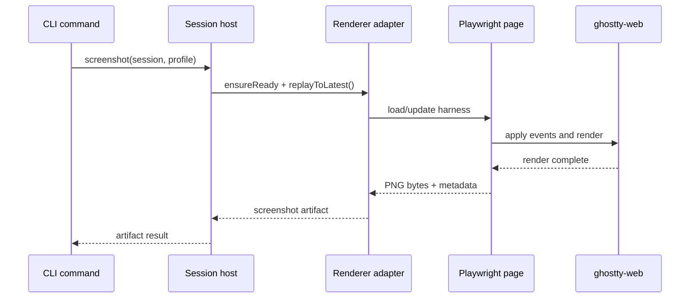

# agent-terminal v1 rendering and artifacts

This document defines how `agent-terminal` turns PTY activity into inspectable artifacts.

## 1. Rendering philosophy

V1 must distinguish between:

- **execution truth**: the PTY event stream,
- **semantic screen truth**: the renderer's parsed terminal state,
- **visual truth**: the renderer's image output.

The artifact system exists to preserve all three.

## 2. Why `ghostty-web` is the reference renderer

V1 chooses `ghostty-web` because it gives the design a strong reference-rendering path while staying inside the TypeScript/browser ecosystem.

Concretely, it enables:

- terminal replay inside a browser harness,
- semantic buffer inspection,
- deterministic screenshot generation,
- and future portability into agent systems that already understand browser automation.

However, `ghostty-web` is **reference truth**, not native platform truth.

That distinction must remain explicit in both code and documentation.

## 3. Artifact classes

V1 should support four artifact classes.

| Artifact          | Purpose                                              | Required in v1 | Shipped as of 2026-03-22 |
| ----------------- | ---------------------------------------------------- | -------------- | ------------------------ |
| Semantic snapshot | Structured screen state for reasoning and assertions | Yes            | Yes                      |
| Screenshot PNG    | Visual verification of layout, color, and wrapping   | Yes            | Yes                      |
| Asciicast         | Portable terminal replay artifact                    | Yes            | Yes                      |
| Replay video      | Reviewer-friendly visual playback                    | Yes            | Yes                      |

## Current implementation status (2026-03-25)

The current implementation now ships all four artifact classes from this design:

- semantic snapshots,
- screenshot PNGs,
- asciicast export,
- and replay-video export.

The current renderer/export path is:

- host-prepared replay input,
- lazy `ghostty-web` boot in headless Chromium,
- structured semantic extraction from replayed terminal state,
- deterministic screenshot capture,
- deterministic replay export to asciicast and WebM,
- and manifest-backed artifact storage under `artifacts/`.

`inspect` now also exposes shipped artifact-health reporting derived from the artifact manifest plus on-disk files. That summary reports artifact totals, `byKind` counts, `missingCount`, an overall `health` value (`healthy`, `missing-artifacts`, `manifest-invalid`, `no-artifacts`, or `unknown`), and optional per-artifact `missing` details when files referenced by the manifest are absent on disk.

Remaining follow-on work is now mostly about design parity and broader future-scope renderer/runtime expansion rather than missing artifact classes. The repo already ships scrollback snapshots, optional per-cell snapshot data, bundled deterministic fonts, and replay timing modes. The main still-open design items are the fuller event-log and snapshot-schema redesigns plus later native/parity work tracked in [`../../ROADMAP.md`](../../ROADMAP.md).

## 4. Canonical replay model

Everything visual should be reproducible from:

- event log,
- render profile,
- replay options,
- tool version.

### 4.1 Replay input

```ts
const replayInput = ReplayInputSchema.parse(rawReplayInput);
```

### 4.2 Replay rules

- Events replay in sequence order.
- Time-based exports may honor recorded delays or use accelerated timing.
- Pure screenshots and semantic snapshots should replay without wall-clock delays.
- Replays must process every resize event in order.

## 5. Render profiles

A render profile pins visual parameters so screenshots are meaningful.

### 5.1 Required built-in profiles

- `reference-dark`
- `reference-light`

### 5.2 Suggested render profile fields

```ts
export interface RenderProfile {
  name: string;
  description: string;
  theme: {
    foreground: string;
    background: string;
    cursor: string;
    cursorAccent: string;
    selectionBackground: string;
    ansi: string[];
    brightAnsi: string[];
  };
  font: {
    family: string;
    sizePx: number;
    lineHeight: number;
    letterSpacing: number;
    disableLigatures: boolean;
  };
  padding: {
    xPx: number;
    yPx: number;
  };
  cursor: {
    style: "block" | "bar" | "underline";
    blink: boolean;
    visibleInScreenshots: boolean;
  };
  viewport: {
    deviceScaleFactor: number;
  };
}
```

### 5.2.1 Current Week 2 profile shape

The shipped Week 2 profile shape is intentionally smaller than the fully elaborated interface below. Today it pins:

- profile name,
- light/dark theme mode,
- font family,
- font size,
- cursor style,
- foreground color,
- and background color.

That smaller shape was enough to make screenshot output stable for the reference renderer while leaving room to add richer font/padding/palette metadata later.

### 5.3 Determinism rules

To keep screenshots reproducible, v1 should:

- bundle the default font rather than trusting system fonts,
- disable ligatures in reference profiles,
- pin device scale factor,
- and pin palette values exactly.

## 6. Recommended bundled visual defaults

The implementation should bundle at least one deterministic monospace font.

Recommended characteristics:

- open license,
- no dependency on system installation,
- clear box-drawing glyphs,
- reliable powerline / unicode fallback story or an explicit documented limitation.

The implementation should record the font asset hash in the artifact manifest.

## 7. Renderer harness design

### 7.1 Harness responsibilities

The browser-side harness should:

- load `ghostty-web`,
- instantiate a terminal with the chosen render profile,
- accept replay events from Node,
- expose snapshot serialization hooks,
- expose screenshot capture hooks,
- and support deterministic replay video export.

### 7.2 Harness isolation rules

The harness should not:

- navigate away,
- open links from terminal content,
- access clipboard,
- or require network access.

### 7.3 Suggested browser assets

```text
src/renderer/ghosttyWeb/page/
├── index.html
├── harness.ts
├── styles.css
└── fonts/
```

## 8. Screenshot pipeline



### 8.1 Screenshot invariants

Each screenshot must record:

- session ID,
- artifact ID,
- captured sequence number,
- renderer backend,
- render profile name,
- render profile hash,
- terminal rows/cols,
- pixel width/height,
- timestamp,
- and sha256 of the output file.

### 8.2 Screenshot defaults

- capture the viewport only,
- include terminal padding,
- include the cursor unless the profile or command disables it,
- preserve alpha only if explicitly requested; otherwise write opaque PNGs for stable diffing.

## 9. Semantic snapshot model

Snapshots should be usable directly by AI agents.

### 9.1 Snapshot goals

A snapshot must answer:

- what text is visible,
- where the cursor is,
- whether alt-screen is active,
- what styles/colors exist per cell,
- what the scrollback length is,
- and which event sequence the snapshot corresponds to.

### 9.2 Suggested structured schema

```ts
export interface TerminalSnapshot {
  sessionId: string;
  snapshotId: string;
  capturedAt: string;
  rendererBackend: string;
  renderProfile: string;
  capturedAtSeq: number;
  terminal: {
    rows: number;
    cols: number;
    altScreen: boolean;
    scrollbackLines: number;
    cursor: {
      row: number;
      col: number;
      visible: boolean;
      style: string;
    };
  };
  viewport: SnapshotLine[];
  scrollback?: SnapshotLine[];
}

export interface SnapshotLine {
  index: number;
  text: string;
  wrapped: boolean;
  cells?: SnapshotCell[];
}

export interface SnapshotCell {
  char: string;
  width: number;
  fg: string | null;
  bg: string | null;
  bold: boolean;
  italic: boolean;
  underline: boolean;
  inverse: boolean;
  blink: boolean;
  dim: boolean;
}
```

### 9.3 Text-only snapshots

For agent reasoning speed, `snapshot --format text` should return only:

- visible lines,
- cursor position,
- rows/cols,
- alt-screen flag,
- and capture sequence.

That avoids forcing every reasoning step to parse full cell objects.

### 9.4 Current shipped snapshot scope (2026-03-25)

The shipped structured snapshot shape is still intentionally simpler than the fuller design schema above, but it is no longer viewport-text-only.

Today `snapshot --format structured` records:

- session ID,
- capture sequence,
- rows/cols,
- cursor row/col,
- alt-screen state,
- visible lines,
- optional scrollback lines when requested,
- and optional per-line `cells` data when `--include-cells` is requested.

That is enough for the current renderer-backed waits, scrollback inspection, and review flows. The still-future work is not "add any cells at all," but rather whether to adopt the fuller terminal/snapshot wrapper model described earlier in this design and how far to expand per-cell metadata beyond the currently shipped fields.

## 10. Asciicast export

### 10.1 Why asciicast is mandatory

Asciicast gives a standard, portable, text-native replay artifact.

It is useful for:

- low-overhead reviewer playback,
- debugging timing-sensitive flows,
- interoperability with other tooling,
- and preserving terminal truth without depending on one renderer forever.

### 10.2 Export rules

- header reflects session dimensions,
- event stream reflects replay timing,
- metadata should record the originating session ID and tool version,
- export should be reproducible from the event log.

## 11. Replay video export

### 11.1 Why video is required in v1

The goal is not just to automate the TUI but to prove behavior to a human reviewer.

A video is often the fastest artifact for verifying:

- resize correctness,
- scroll behavior,
- selection/highlight transitions,
- cursor oddities,
- and transient glitches.

### 11.2 Export strategy

V1 should export video by deterministic replay in the browser harness.

Recommended path:

1. load replay events into a fresh renderer page,
2. drive replay with either real or accelerated timing,
3. capture video via Playwright,
4. emit `.webm` as the default format.

### 11.3 Replay timing modes

Support at least:

- `recorded`: preserve original delays,
- `accelerated`: compress idle gaps above a threshold,
- `max-speed`: replay as fast as the renderer can process.

`accelerated` should be the default for reviewer artifacts.

## 12. Artifact manifest

Each session should maintain a manifest of generated artifacts.

### 12.1 Suggested manifest schema

```ts
export interface SessionArtifactManifest {
  sessionId: string;
  version: 1;
  artifacts: ArtifactEntry[];
}

export interface ArtifactEntry {
  id: string;
  kind: "snapshot" | "screenshot" | "recording" | "video";
  path: string;
  sha256: string;
  bytes: number;
  createdAt: string;
  capturedAtSeq: number;
  rendererBackend?: string;
  renderProfile?: string;
  metadata: Record<string, unknown>;
}
```

### 12.2 Manifest invariants

- every emitted artifact appears exactly once,
- manifest writes are atomic,
- artifacts missing from disk are flagged during `inspect` and `doctor`,
- manifests never point at temp files.

### 12.3 Current Week 2 manifest and layout

The shipped Week 2 implementation currently writes artifacts under:

```text
artifacts/
  manifest.json
  snapshot-<seq>-structured.json
  snapshot-<seq>-text.json
  screenshot-<seq>-<profile>.png
```

That is simpler than the broader naming scheme below, but it already preserves the two most important debugging dimensions: capture sequence and render profile.

## 13. Future native renderer adapter contract

The reference renderer should not lock out native backends.

### 13.1 Native backend responsibilities

A future native backend must be able to answer at least:

- can I drive a real terminal instance,
- can I feed or observe the live PTY or equivalent,
- can I capture a screenshot,
- can I export a video,
- and can I report enough metadata to explain what environment produced the artifact.

### 13.2 Native artifact metadata

When native backends are added later, artifacts should record extra fields such as:

- terminal app name,
- terminal app version,
- OS version,
- font configuration,
- scale factor,
- compositor details when discoverable.

## 14. Reference vs native comparison strategy

V1 should not attempt to declare one screenshot the absolute truth.

Instead, the product should treat native backends as a later comparison layer:

- reference screenshots catch regressions deterministically,
- native screenshots catch platform-specific surprises.

## 15. Recommended artifact naming

Within a session directory:

```text
snapshots/
  snap_<seq>_<shortid>.json
screenshots/
  shot_<seq>_<profile>_<shortid>.png
recordings/
  rec_<seq>_<shortid>.cast
recordings/
  vid_<seq>_<profile>_<shortid>.webm
```

Including sequence and profile in filenames makes debugging easier even without opening the manifest.

## 16. Rendering failure modes and mitigations

### 16.1 Browser unavailable

Mitigation:

- `doctor` reports it clearly,
- render commands fail with `DEPENDENCY_MISSING` or `RENDERER_START_FAILED`.

### 16.2 Renderer drift after crash

Mitigation:

- rebuild from event log,
- retry the request once,
- include retry metadata in debug logs.

### 16.3 Font mismatch

Mitigation:

- bundle the default font,
- hash the font asset in artifact metadata,
- fail loudly if the bundled font cannot load.

### 16.4 Giant sessions

Mitigation:

- allow snapshot scoping,
- optionally checkpoint replay state in future,
- warn when replay cost exceeds threshold.

## 17. Rendering and artifact acceptance checklist

This area is complete only when:

- semantic snapshots are readable by both humans and AI agents,
- screenshot artifacts are deterministic under the reference profile,
- asciicast export matches the event log,
- replay video export exists and is reviewable,
- every artifact is manifest-backed and hash-stamped,
- and renderer crashes can be repaired from replay without losing the session.

## 18. Current gap summary (2026-03-25)

As of 2026-03-25, the repository has shipped the Week 4–6 rendering/artifact closeout that this document previously tracked as open:

- scrollback-aware snapshots through `snapshot --include-scrollback` / `includeScrollback`,
- optional per-cell snapshot data through `snapshot --include-cells`, including shipped `fg`, `bg`, `bold`, `italic`, `underline`, and `strikethrough` fields,
- screenshot metadata enrichment (`rendererBackend`, `pixelWidth`, `pixelHeight`, `sha256`, and `renderProfileHash`),
- render-profile hashing via `hashProfile(...)`,
- bundled deterministic JetBrains Mono assets for the reference renderer,
- and replay timing modes for WebM export (`recorded`, `accelerated`, and `max-speed`).

The remaining design-level follow-ons are now narrower:

- whether to adopt the fuller terminal/snapshot wrapper model sketched earlier in this document,
- whether to expand per-cell metadata beyond the currently shipped fields (for example `width`, `inverse`, `blink`, `dim`, or richer cursor metadata),
- runtime renderer capability discovery beyond the current static backend list,
- larger event-log and snapshot-schema redesign questions,
- and later native renderer/parity work tracked in [`../../ROADMAP.md`](../../ROADMAP.md).
