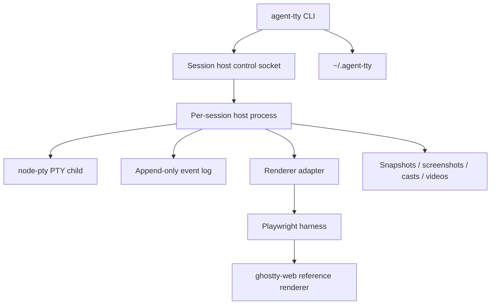

# agent-tty architecture overview

`agent-tty` is a CLI-first terminal automation system for AI agents and humans.

It is designed to let an agent:

- create and manage long-lived terminal sessions,
- send text, paste payloads, key chords, resize events, and signals,
- wait for TUI state changes,
- inspect semantic terminal state,
- capture deterministic screenshots,
- export replay artifacts that reviewers can inspect,
- and later swap the reference renderer for native terminal backends.

This design intentionally describes a **general product**, not a Mux-specific implementation. A future Mux integration should consume `agent-tty` as an external CLI/runtime rather than baking Mux-specific assumptions into the design.

## Current shipped status

The current `0.3.x` line is centered on reliable, isolated, reviewable terminal and TUI automation. The shipped surface includes `run` for robust in-session command execution, split semantic/visual renderer defaults, renderer/browser-path handling that respects isolated-home workflows, and isolation-aware `doctor --json` diagnostics on top of lifecycle, snapshot, screenshot, and export work. Larger asks such as additional native renderers, mouse input, remote/network sessions, MCP wrapping, and broader semantic TUI automation remain intentionally deferred.

The repository now ships the first three milestones of this design plus Weeks 4–7 of CLI/artifact/lifecycle hardening, config/rendering/platform closeout, contract/introspection reconciliation, and Week 7 contract/doc ratification:

- long-lived session hosts,
- PTY control and append-only event logs,
- renderer-backed `snapshot` and `wait`,
- deterministic `screenshot`,
- `record export --format asciicast`,
- `record export --format webm`,
- artifact manifests and `gc`,
- shared global CLI context and differentiated exit codes,
- end-to-end CLI/config wiring for `--log-level`, `--profile`, `--idle-timeout-ms`, and `--append-newline`,
- replay timing modes, bundled fonts, and optional per-cell snapshots,
- richer `inspect --json` artifact-health and termination reporting,
- golden-envelope coverage for the most important shipped public surfaces,
- macOS CI validation,
- and proof bundles under `dogfood/`.

Week 7 closed the design-synchronization pass for the shipped v1 surface. Week 8 then completed runtime capability discovery, richer renderer/session introspection, the remaining lower-priority public-envelope locks, and proof-bundle normalization/validation. Week 9 then closed the pre-`0.1.0` release-readiness milestone: isolated-environment renderer reliability is now part of the shipped contract, the higher-level in-session `run` primitive is documented and shipped, TUI-focused diagnostics/docs are in place, and the remaining large asks are intentionally deferred future-scope work rather than release blockers.

The stable contract has a dedicated home: use [`../RELEASE.md`](../RELEASE.md) for the shipping bar, [`./README.md`](./README.md) for the design index, and [`./archive/`](./archive/) for the historical week-by-week planning/status trail.

## Executive summary

The recommended v1 shape is:

1. **CLI-first** public surface: `agent-tty ...`
2. **No MCP in v1**
3. **TypeScript/Node** implementation
4. **One session-host process per terminal session**, not a global daemon
5. **`node-pty`** for PTY/process control
6. **`libghostty-vt`** as the preferred semantic renderer when available, with **`ghostty-web`** as the visual reference renderer and semantic fallback
7. **Playwright** as the screenshot / replay-video harness
8. **Event-log-as-truth** architecture so screenshots, snapshots, and recordings can be replayed deterministically
9. **Renderer adapter interface** from day one so renderer defaults can evolve without redesigning the CLI

## Why this shape

This shape optimizes for the constraints discussed so far:

- it gives AI agents a fast and forgiving implementation loop,
- it keeps the public interface usable outside any single agent framework,
- it supports both semantic inspection and visual inspection,
- it avoids committing v1 to one terminal emulator forever,
- and it preserves a clean path to a later Rust rewrite of hot paths.

The product is inspired by `agent-browser`'s stateful, inspectable automation model, applied to terminal sessions instead of browser pages.

## Primary goals

### Product goals

- Provide a stable CLI for automating interactive terminal sessions.
- Make terminal automation **inspectable**, not just scriptable.
- Make TUI dogfooding practical for agents.
- Produce review artifacts that humans can verify.
- Keep the product useful in CI, local development, and agent loops.

### Technical goals

- Support long-lived sessions across multiple CLI invocations.
- Support Linux and macOS as tier-1 targets.
- Support Windows as a tier-2 target with explicit caveats.
- Keep rendering swappable.
- Keep the JSON contract stable and machine-friendly.
- Keep failure recovery simple and local.

## Non-goals for v1

- No MCP server in v1.
- No network service or multi-user remote control in v1.
- No requirement that sessions survive host crashes or machine reboots.
- No native-renderer parity guarantee in v1 screenshots.
- No kitty graphics / sixel / inline image parity in v1.
- No accessibility audit scope beyond basic screenshot readability and text extraction.
- No requirement that `attach` be fully equivalent to a first-class terminal emulator.

## Top-level decisions

### 1) CLI-first public interface

The public contract is the CLI and its JSON output, not an internal RPC API and not Mux tools.

This keeps `agent-tty` reusable by:

- AI coding agents,
- shell scripts,
- CI,
- future MCP wrappers,
- and humans debugging locally.

### 2) TypeScript/Node for v1

TypeScript wins v1 because it lets one implementation language cover:

- PTY control,
- CLI development,
- schema validation,
- reference rendering,
- screenshots,
- replay capture,
- and future browser-like integrations.

The design explicitly leaves room for later Rust rewrites of:

- event-log replay,
- ANSI parsing,
- diffing,
- and native renderer adapters.

### 3) Session-host process per session

Each session gets a dedicated background host process that owns:

- the PTY,
- session metadata,
- the event log,
- optional renderer workers,
- and artifact generation.

This avoids the complexity of a single global daemon in v1 while still supporting long-lived sessions.

### 4) Event log as canonical truth

The canonical persistent record of a session is an append-only event log.

That lets v1:

- reconstruct renderer state after renderer crashes,
- regenerate screenshots deterministically,
- export asciicasts,
- render videos from replay,
- and debug failures after the fact.

### 5) Semantic and visual renderers stay separated

V1 uses two Ghostty-backed renderer paths by default:

- `libghostty-vt` for semantic snapshots, screen hashes, and render-backed waits when the optional native package is available,
- `ghostty-web` for deterministic screenshots and deterministic video replay,
- `ghostty-web` again as the semantic fallback when native rendering is unavailable.

The architecture still reserves additional native backends for later:

- WezTerm-like native automation,
- platform-specific terminal automation,
- platform-specific compatibility runs.

## Tiered truth model

`agent-tty` should treat terminal truth as layered rather than singular.

| Layer                  | Source of truth                    | What it answers                                           |
| ---------------------- | ---------------------------------- | --------------------------------------------------------- |
| Execution truth        | PTY + event log                    | What bytes, signals, and resize events actually occurred? |
| Semantic renderer truth | `libghostty-vt` or fallback replay | What terminal cells/text does Ghostty's VT state expose?  |
| Reference visual truth | `ghostty-web` replay/render        | What does a pinned reference renderer show?               |
| Native visual truth    | Future native adapter              | What does a real platform terminal show?                  |

This prevents v1 from pretending reference rendering is identical to native platform rendering.

## Success criteria for v1

V1 is successful when an AI agent can:

1. launch a sample TUI,
2. send keys and pasted text,
3. resize the terminal,
4. wait until the screen reaches a target state,
5. fetch a semantic snapshot of the screen,
6. capture a PNG screenshot,
7. destroy the session,
8. export asciicast or WebM replay artifacts,
9. and leave behind an artifact bundle that a human reviewer can inspect.

## Deliverables in this design set

This design file is the entry point. Detailed supporting docs live in the active reference set under `design/20260319_agent-tty-v1/`, while historical planning/status material lives under `design/archive/`.

### Active reference set

- [01-architecture.md](./20260319_agent-tty-v1/01-architecture.md)
- [02-cli-contract.md](./20260319_agent-tty-v1/02-cli-contract.md)
- [03-rendering-and-artifacts.md](./20260319_agent-tty-v1/03-rendering-and-artifacts.md)
- [04-implementation-plan.md](./20260319_agent-tty-v1/04-implementation-plan.md)
- [05-dogfooding-and-validation.md](./20260319_agent-tty-v1/05-dogfooding-and-validation.md)

### Historical archive

- [06-roadmap-and-week-1-plan.md](./archive/06-roadmap-and-week-1-plan.md)
- [07-week-2-plan.md](./archive/07-week-2-plan.md)
- [08-week-3-status.md](./archive/08-week-3-status.md)
- [09-week-4-plan.md](./archive/09-week-4-plan.md)
- [10-week-4-status.md](./archive/10-week-4-status.md)
- [11-week-5-plan.md](./archive/11-week-5-plan.md)
- [12-week-5-status.md](./archive/12-week-5-status.md)
- [13-week-6-plan.md](./archive/13-week-6-plan.md)
- [14-week-6-status.md](./archive/14-week-6-status.md)
- [15-week-7-plan.md](./archive/15-week-7-plan.md)
- [16-week-8-plan.md](./archive/16-week-8-plan.md)
- [17-week-9-plan.md](./archive/17-week-9-plan.md)

## High-level architecture

## Build contract for the implementing AI agent

Any implementation based on this design should preserve these boundaries:

- The **CLI contract** is public and versioned.
- The **session host** is internal and may evolve.
- The **renderer adapter** is internal but must be interface-based from day one.
- The **event log format** is internal-but-stable enough to support replay and artifacts.
- The **artifact manifest** is public enough for automation consumers and reviewers.

The implementation should not:

- hard-code Mux concepts,
- hard-code a single future MCP transport,
- assume one renderer forever,
- or couple screenshot generation directly to live PTY ownership.

## Recommended implementation order

Implement in this order:

1. session lifecycle,
2. input + resize + signals,
3. event log,
4. semantic snapshots,
5. screenshots,
6. replay exports,
7. dogfooding fixtures,
8. native-backend extension points.

Do **not** start with native terminal automation. The reference-renderer path must exist first.

## Definition of done

The implementing AI agent should treat v1 as done only when all of the following are true:

- the CLI contract in `02-cli-contract.md` is implemented for the v1 command set,
- the artifact model in `03-rendering-and-artifacts.md` is implemented,
- the milestone acceptance criteria in `04-implementation-plan.md` are green,
- the dogfooding scenarios in `05-dogfooding-and-validation.md` have been executed,
- and the required screenshots and video proof artifacts have been produced.
